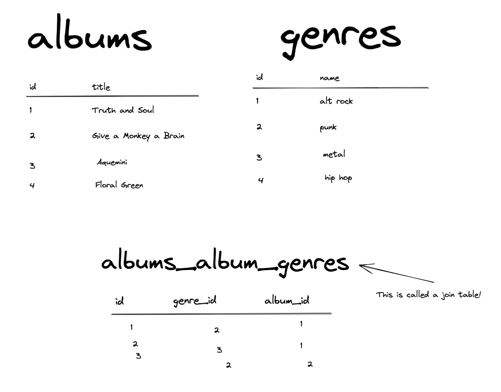

# Many-to-many Diagram

If you have a many-to-many relationship between the Album and Genre models (meaning an album can have many genres, and many albums can belong to the same genre), your code might look something like this:

```py
class Album(models.Model):
    title = models.CharField(max_length=255)
    genres = models.ManyToManyField("Genre", related_name="albums")


class Genre(models.Model):
    name = models.CharField(max_length=255)
    slug = models.SlugField(max_length=75)
```

---

And the tables Django creates for you would look something like this:


